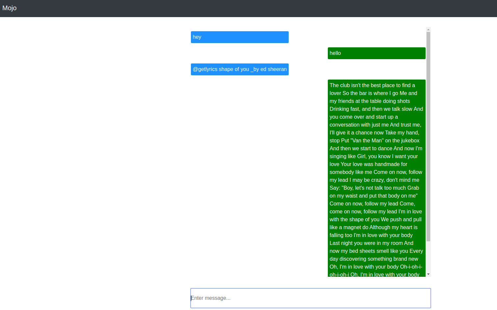

# Mojo jojo

## Installation

### Requirements
* Python 3.6.5

### Cloning the repository
```bash
git clone https://github.com/lydiah2015/myBlog.git && cd myBlog
```

### Creating a virtual environment
```bash
sudo apt-get install python3.6-venv
python3.6 -m venv virtual
source virtual/bin/activate
```

### Installing dependencies
```bash
pip install -r requirements.txt
```

### Running Tests
```bash
python manage.py test
```

### required env variables
- create a `.env` file at the root of the project and add the following 
```
MUSIX_MATCH_API= Your MUSIX_MATCH_API
DIALOGFLOW_PROJECT_ID=Your DIALOGFLOW_PROJECT_ID
GOOGLE_APPLICATION_CREDENTIALS='credentials/YOUR_CREDENTIALS.json'
PUSHER_APP_ID=your PUSHER_APP_ID
PUSHER_KEY=Your PUSHER_KEY
PUSHER_SECRET=Your PUSHER_SECRET
PUSHER_CLUSTER=Your PUSHER_CLUSTER
```
- create a folder called `credentials` at the root and the save `YOUR_CREDENTIALS.json` file there.

### Running in development
```bash
python manage.py runserver
```

## Usage
- Open the app on your browser, by default on `127.0.0.1:5000`.
- For small talk, just chat with the bot

### Bot commands
#### get track lyrics by track name and artist
- send the following command to the bot
```
@getlyrics track _by artist
#example 
@getlyrics shape of you by ed sheeran
```
